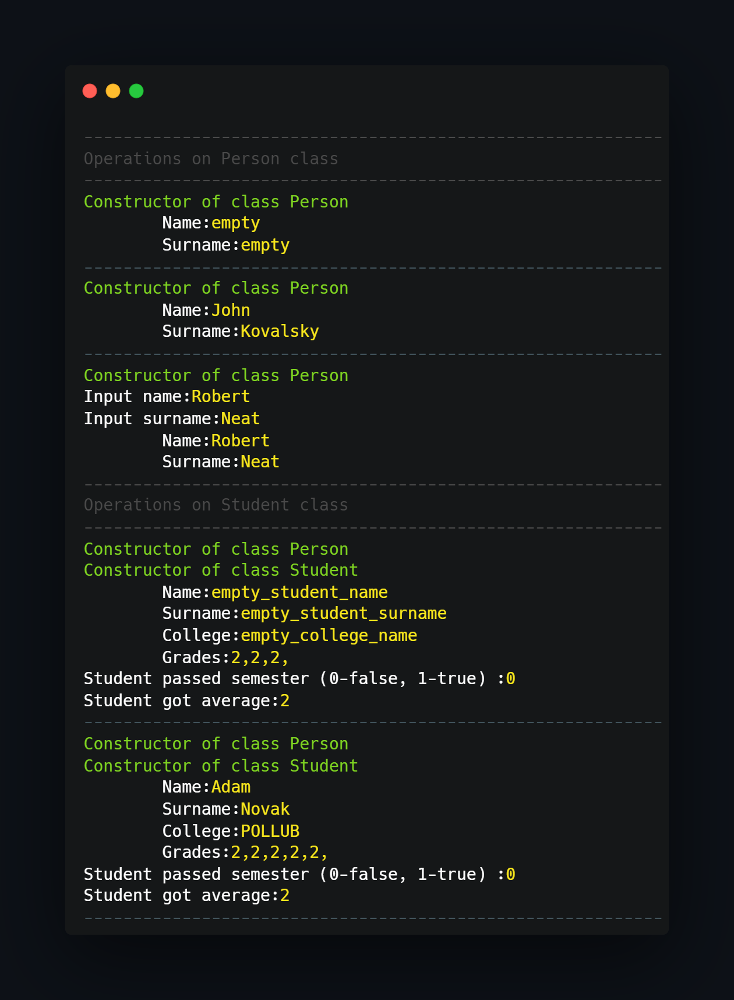

## What project do?
___

Project shows implementation of simple classes dependencies and inheritance.
There are 5 classes that inherit in this way:

~~~~
Person:
    -> Student
    -> Worker
        -> Manual Worker
        -> Intellect Worker
~~~~

For example Intellect worker is Worker and Person at the same time so it have Name as every person, but have also MonthlyPay field inside.

Every class have its own methods that are inherited or used in decendant classes or that are obscured by descendant methods with the same name.

### Program execution:

~~~
Person:
-string name, surname;
-read(), display();
-----------------------------------
Student:
-string college_name
-int grade_count
- float * grades //dynamic array
- read(), display(), count_average(), did_pass()
--------------------------------------
Worker:
-string company_name,
-int bonus,
- read(), display()
-------------------------------------
Manual Worker:
- float hourly_rate,
- int hourRate,
- read(), display(), count_pay()
-------------------------------------
Intellect Worker:
- float monthly_salary,
- read(), display(), calculate_pay()

~~~

## How to use?
___
Just import project to CodeBlocks and compile/run.

<!--https://banner.godori.dev/-->
<!--https://shields.io/-->
<!--https://carbon.now.sh/-->